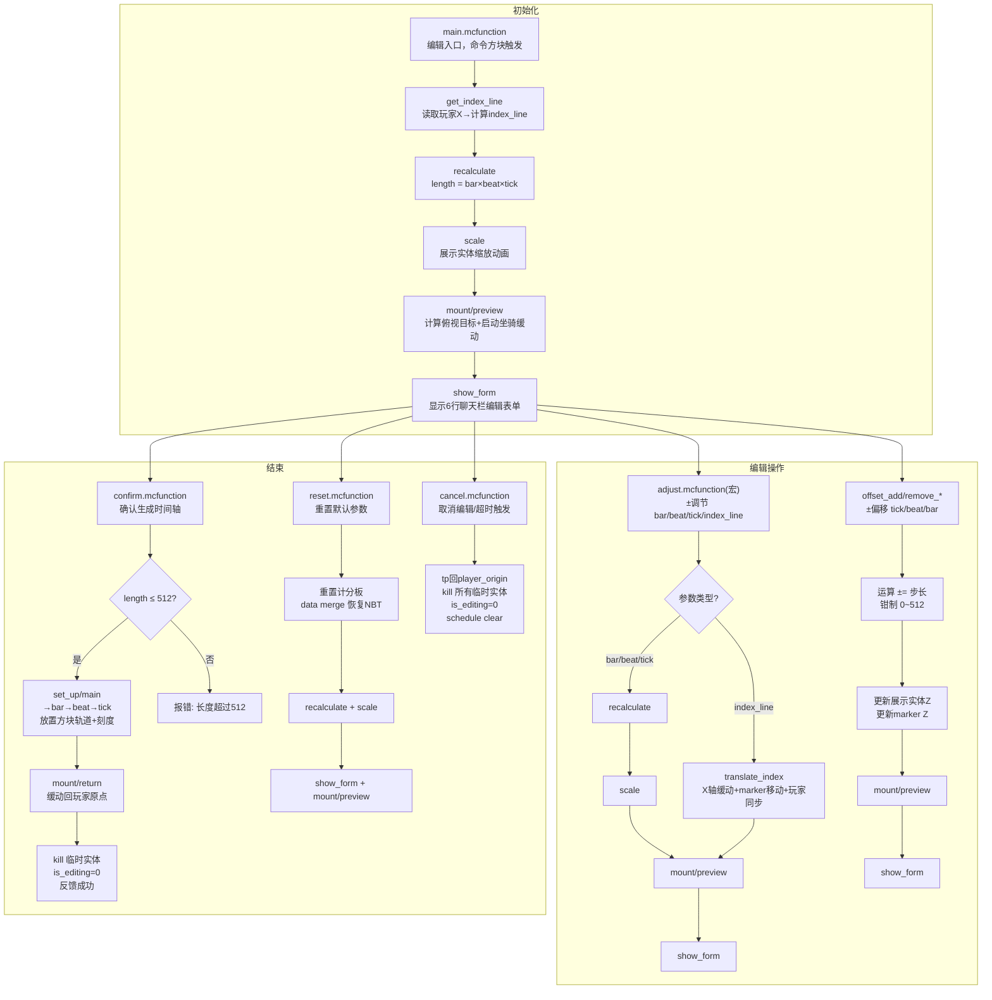

# editor — 时间轴编辑器

## 概述

时间轴编辑器是 **rhythm_axe** 数据包的核心创作工具。玩家通过命令方块进入编辑模式后，在聊天栏表单中设置时间轴参数（小节数、拍数、刻数、偏移量），实时预览轨道，确认后自动生成方块轨道。

## 进入编辑

由命令方块执行（按钮在唱片机上），`@s` 为命令方块：

```mcfunction
function rhythm_axe:editor/editor
```

进入后：

1. 读取玩家当前位置 → 计算 `index_line`（所在行号）
2. 召唤 `block_display` 展示实体 + `marker` 时间轴原点
3. 召唤 `armor_stand` 坐骑，玩家骑乘后传送到高空俯视
4. 显示聊天栏编辑表单

## 编辑表单

表单由 `show_form.mcfunction` 生成，分 6 行显示：

```text
=====================================
    小节数     每小节节拍数      每拍刻数 
[-] 8 [+]      [-] 4 [+]        [-] 8 [+]    
                           < 0 >            
       <<< << < 0 > >> >>>
     [确定]     长度:256 ✓   [重置] [取消]
=====================================
```

- **第 2 行**：`小节数` / `每小节节拍数` / `每拍刻数` 的数值调节
  - 每个参数带 `[-]` / `[+]` 按钮，绿色=可点，红色=已达边界
  - 范围：bar 1~99, beat_per_bar 1~16, tick_per_beat 1~40
- **第 3 行**：`index_line`（时间轴行号），带 `<` / `>` 按钮，范围 0~64
- **第 4 行**：`offset`（Z 轴偏移量），带 `<<<`(一小节) / `<<`(一拍) / `<`(一格) 按钮
- **第 5 行**：`[确定]` → 生成轨道 / 长度超 512 则报错 / `[重置]` → 恢复默认参数 / `[取消]` → 退出编辑

## 计分板一览

### objectives

| Objective | 类型 | 用途 |
| --- | --- | --- |
| `editor` | dummy | 编辑系统主计分板 |
| `teleport` | dummy | 缓动传送计算 |
| `const` | dummy | 常量表（全局共享，在 `load.mcfunction` 中初始化） |
| `set_up_timeline` | dummy | 轨道生成循环计分板 |

### editor 计分板键名

| 键名 | 含义 | 范围 | 读写位置 |
| --- | --- | --- | --- |
| `is_editing` | 编辑状态锁 | 0/1 | main(写1), cancel/confirm(写0), 其他(读) |
| `bar` | 小节数 | 1~99 | show_form, adjust |
| `beat_per_bar` | 每小节拍数 | 1~16 | show_form, adjust |
| `tick_per_beat` | 每拍刻数 | 1~40 | show_form, adjust |
| `offset` | Z 偏移量 | 0~512 | show_form, offset_* |
| `length` | 时间轴总长(tick) | 计算值 | recalculate |
| `timeline_end` | 终点 = length + offset | 计算值 | recalculate |
| `index_line` | 当前行号 | 0~64 | show_form, adjust, get_index_line |
| `index_map` | 谱面索引 | 0 | *(未实现)* |
| `calc` | 通用计算临时值 | — | 各处 |
| `preview_x` | 展示实体 X 坐标 | — | main |
| `preview_origin_x` | 预览原点 X（用于重置） | — | main(写), reset(读), translate_index(累加) |
| `preview_origin_z` | 预览原点 Z（用于重置） | — | main(写), reset(读) |
| `old_offset` | 操作前的 offset 快照 | — | offset_* |
| `old_index_line` | 操作前的 index_line 快照 | — | adjust |
| `delta` | offset 变化量 | — | offset_* |
| `delta_x` | index_line 变化量×8 | — | translate_index |
| `current_x` | timeline_start 的当前 X | — | translate_index |
| `z` | 展示实体 Z 坐标 | — | offset_* |
| `#plr_dx` | 玩家 X 位移量（临时） | — | adjust |
| `#plr_x` | 玩家目标 X（临时） | — | adjust |

### teleport 计分板键名

| 键名 | 含义 | 读写位置 |
| --- | --- | --- |
| `base_x/y/z` | 缓动起点 | preview, return |
| `start_x/y/z` | timeline_start 坐标 | preview |
| `target_x/y/z` | 缓动目标 | preview, return |
| `Dx/Dy/Dz` | 起点到目标的差值 | preview, return, tick |
| `step` | 当前步数(0~16) | preview, return, tick |
| `mount_gen` | 动画代次 | preview, return(增), tick(读) |
| `this_gen` | 当前动画代次 | tick(写/读) |
| `#n` / `#cube` / `#frac` | 缓动计算中间值 | tick |
| `px/py/pz` | 当前帧位置 | tick |

## 实体标签一览

| 标签 | 实体类型 | 用途 | 创建 | 销毁 |
| --- | --- | --- | --- | --- |
| `timeline_preview` | block_display | 预览展示实体 | main | confirm/cancel |
| `timeline_start` | marker | 时间轴原点 | main | confirm/cancel |
| `timeline_mount` | armor_stand | 玩家坐骑 | main | cancel/return |
| `player_origin` | marker | 玩家返回点 | main | confirm/cancel |
| `return_mount` | armor_stand | 返回模式标记 | return | tick(16步后) |
| `point` | marker | 轨道生成指针 | set_up/main | set_up/main |
| `anim_task` | block_display | 动画任务标记 | scale/translate_index | main |

## 文件结构

```text
editor/
├── help.md                        ← 本文档
├── main.mcfunction                ← 编辑器入口（命令方块调用）
├── show_form.mcfunction           ← 聊天栏编辑表单（输出6行 tellraw）
├── confirm.mcfunction             ← 确认生成时间轴
├── cancel.mcfunction              ← 取消编辑，恢复轨道
├── reset.mcfunction               ← 重置参数为默认值
├── param/
│   ├── adjust.mcfunction          ← 宏函数：bar/beat/tick/index_line 数值调节
│   ├── offset_add_bar.mcfunction  ← offset 右移一小节
│   ├── offset_add_beat.mcfunction ← offset 右移一拍
│   ├── offset_add_tick.mcfunction ← offset 右移一格
│   ├── offset_remove_bar.mcfunction  ← offset 左移一小节
│   ├── offset_remove_beat.mcfunction ← offset 左移一拍
│   └── offset_remove_tick.mcfunction ← offset 左移一格
├── preview/
│   ├── entity/
│   │   ├── scale.mcfunction           ← 展示实体缩放动画（三次方缓出）
│   │   └── translate_index.mcfunction ← index_line 横向缓动动画
│   └── mount/
│       ├── preview.mcfunction     ← 计算俯视目标 + 启动缓动循环
│       ├── return.mcfunction      ← 计算返回原点 + 启动缓动循环
│       └── tick.mcfunction        ← 每刻缓动步进（16步/自递归+代次检测）
├── set_up/
│   ├── main.mcfunction            ← 轨道生成入口（创建指针 → bar 循环）
│   ├── bar.mcfunction             ← 小节循环层（外层）
│   ├── beat.mcfunction            ← 拍循环层（中层）
│   └── tick.mcfunction            ← 刻度循环层（内层：放置方块+刻度标记）
└── util/
    ├── get_index_line.mcfunction  ← 根据玩家X坐标计算 index_line
    └── recalculate.mcfunction     ← 计算 length = bar × beat_per_bar × tick_per_beat
```

## 核心流程



## 动画系统

编辑器使用 `utilization/display_animation` 驱动两种动画：

### 缩放动画（scale）

```mcfunction
# 目标: scale.Z = length（以 1/100 为单位）
# 十六次方缓出，16 tick
# ANIM_APPLY_POSITION = 0（缩放无需提交到 Pos）
# 由 recalculate → scale，或 adjust → scale 触发
```

### 横向缓动（translate_index）

```mcfunction
# 触发条件：index_line 变化
# delta_x = (old_index_line - index_line) × 8
# 十六次方缓出，16 tick
# ANIM_APPLY_POSITION = 0（translation 直接累积偏移）
# 同步更新: timeline_start marker Pos[0], preview_origin_x
# 同步移动: 玩家 X 位置
```

> ⚠ **注意**：ANIM_APPLY_POSITION = 0 意味着 translation 累积偏移而非提交到 Pos。这样在快速连续点击时不会丢失中间偏移量。reset 会通过 `data merge` 重置 translation，cancel/confirm 会 kill 实体。

### 坐骑缓动（mount）

```text
mount/preview（俯视目标）
  公式:
    target_x = timeline_start.X
    target_z = max(timeline_start.Z + length/8×5, 10006)
    target_y = max(timeline_start.Y + length/4, 16)
  缓动: 三次方缓出(cubic out), 16 tick
  代次机制: mount_gen 递增 → 旧 tick 自动停止 → 防止动画重叠

mount/return（返回原点）
  目标: player_origin marker 位置
  同三次方缓出 16 tick
  结束后自动 kill 坐骑（带 return_mount 标签）
```

## Storage 命名空间

仅一个 `rhythm_axe:editor`，用于 mount 缓动系统：

| 字段 | 类型 | 写入位置 | 读取位置 |
| --- | --- | --- | --- |
| `base_x` | double | preview, return | tick |
| `base_y` | double | preview, return | tick |
| `base_z` | double | preview, return | tick |
| `target_x` | double | preview, return | tick |
| `target_y` | double | preview, return | tick |
| `target_z` | double | preview, return | tick |
| `mount_gen` | int | preview, return | tick |

## 轨道生成说明

`set_up/` 使用三层递归循环生成轨道方块：

```text
bar（外层）→ beat（中层）→ tick（内层）
```

- 每个 tick 放置一个砂岩（`~3 ~-1 ~`）
- 最后一个 tick 用红砂岩标记终点
- 侧面颜色基于 `(color_group, color_group_number)` 交替：
  - (0,0)=浅蓝 / (0,1)=黄 / (1,0)=蓝 / (1,1)=橙
- 刻度标记：白色 terracotta 背景 + 分段彩色刻度线
  - 刻度分段数自动适配 tick_per_beat（2/3/4/6/8/9/12/16 分段）
  - 起始刻度为黑色

## 外部依赖

| 模块 | 用途 |
| --- | --- |
| `utilization/display_animation/display_animation` | 展示实体缓动动画引擎 |
| `const` 计分板 | 常量 0, 1, 2, 3, 4, 100, 512, 4096, 10000 等 |

## 编程约定

- **Objective 键名**：全小写下划线，如 `is_editing`, `preview_origin_x`
- **计分板操作符**：两边加空格：`score_a editor += score_b editor`
- **函数路径**：使用完整命名空间：`rhythm_axe:editor/preview/mount/preview`
- **编辑状态检测**：所有会修改数据的函数入口第一件事检查 `is_editing`
- **offset 文件**：不调用 adjust 宏函数，直接运算后更新坐标、刷新表单
